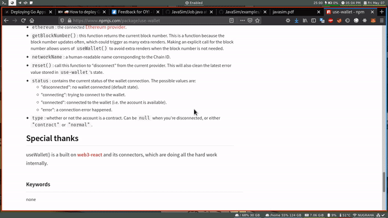

# dmenu Dictionary

## Installation
- Clone this repository
- Get your API key on [RapidAPI](https://rapidapi.com/dpventures/api/wordsapi)
- Update apikey with your own
- ???
- Profit

## Prerequisite
- [dmenu](https://tools.suckless.org/dmenu/)
- curl
- [jq](https://stedolan.github.io/jq/) 
